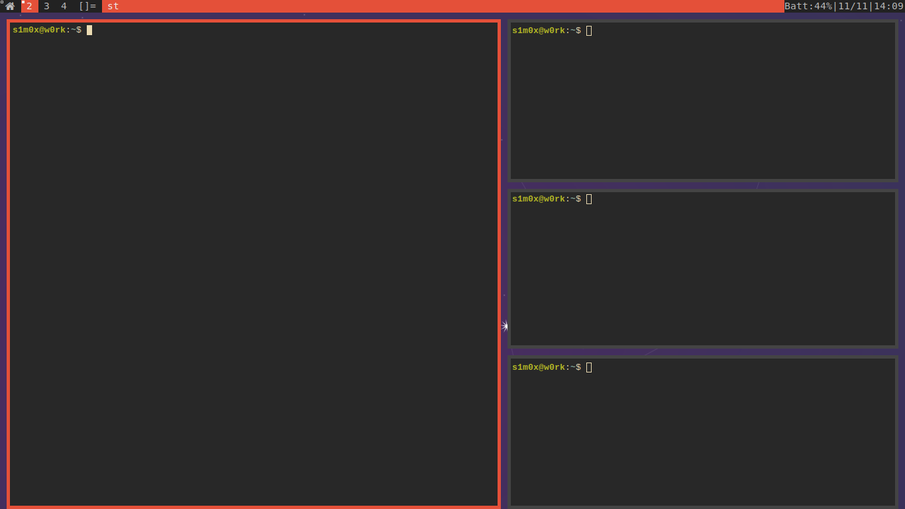
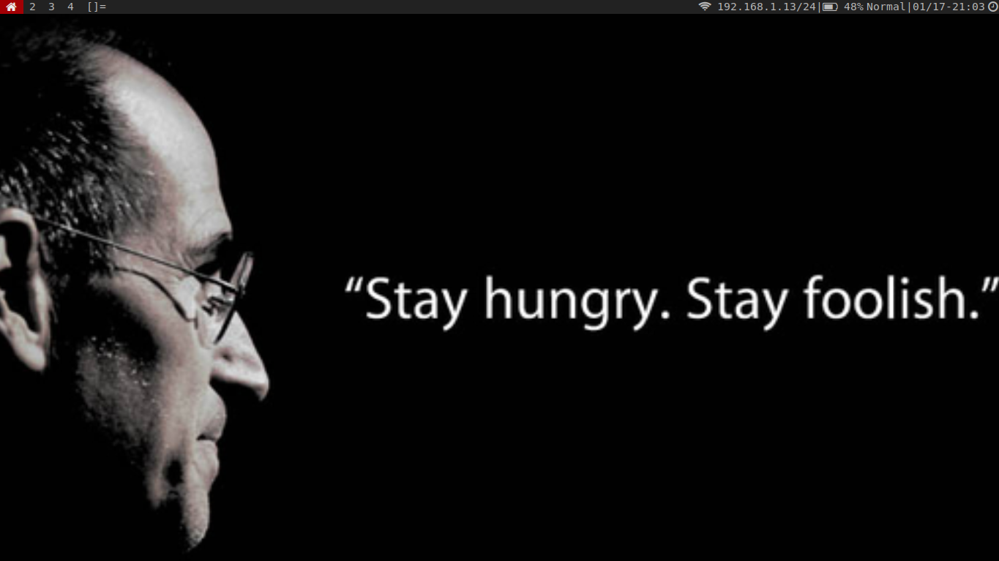
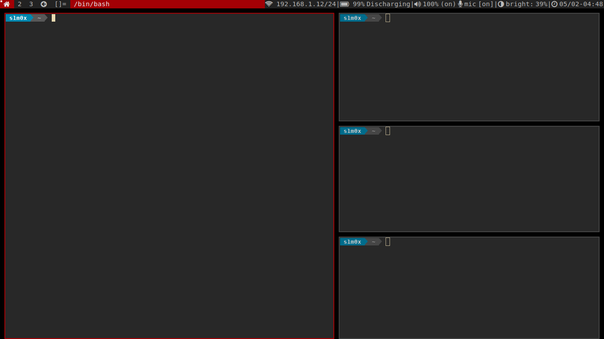

dwm - dynamic window manager
===

dwm is a tiling window manager, I like working efficiently and this fits my needs ! this is my own build of dwm the suckeless's WM.

### applied patches:

patches are organized in branches, and the master branch had all other branches merged altogether ! it's the final build so far.

### How it looks like :

### the new look :

- minor changes to borders, colors, 
- adding awesome unicode (icons)

- New changes ! (02-05-2021), major changes from the status bar !, also the warp patch resolving the dual monitor cursor focus !

